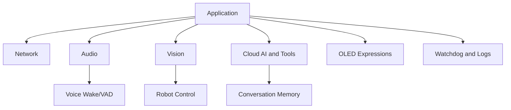
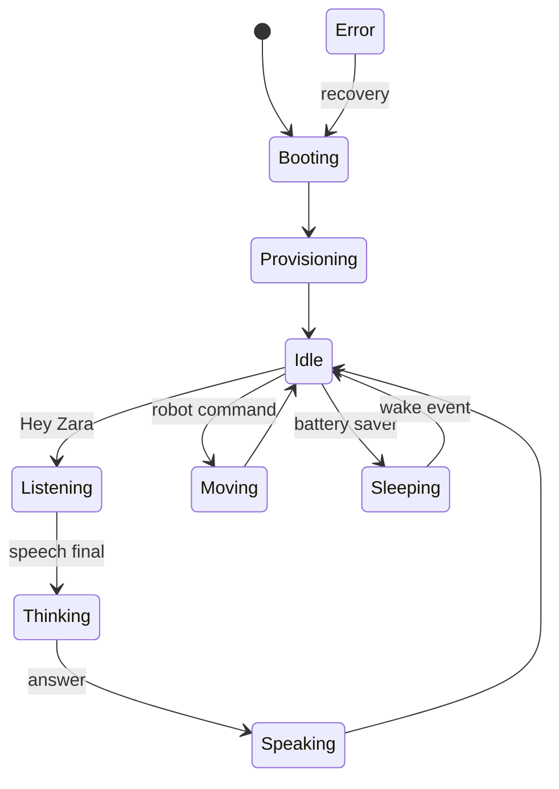
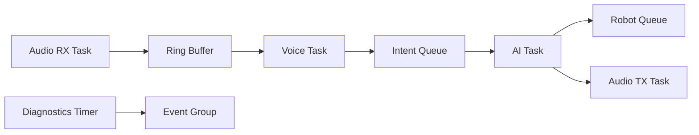

# ZaraOS Architecture

```mermaid
graph TD
  app[Application] --> network[Network]
  app --> audio[Audio]
  audio --> voice[Voice Wake/VAD]
  app --> vision[Vision]
  vision --> robot[Robot Control]
  app --> ai[Cloud AI and Tools]
  ai --> memory[Conversation Memory]
  app --> display[OLED Expressions]
  app --> diagnostics[Watchdog and Logs]
```

## State machine

```mermaid
stateDiagram-v2
  [*] --> Booting
  Booting --> Provisioning
  Provisioning --> Idle
  Idle --> Listening: Hey Zara
  Listening --> Thinking: speech final
  Thinking --> Speaking: answer
  Speaking --> Idle
  Idle --> Moving: robot command
  Moving --> Idle
  Idle --> Sleeping: battery saver
  Sleeping --> Idle: wake event
  Error --> Booting: recovery
```

## Task model

```mermaid
graph LR
  mic[Audio RX Task] --> rb[Ring Buffer]
  rb --> vad[Voice Task]
  vad --> q[Intent Queue]
  q --> ai[AI Task]
  ai --> motor[Robot Queue]
  ai --> tts[Audio TX Task]
  diag[Diagnostics Timer] --> app[Event Group]
```
